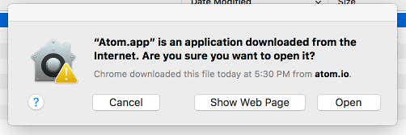

# Pick a text editor

## Why?

There are so many text editors out there, many of which are Interactive Development
Environments (IDEs) that you will probably get a different answer from every developer
you ask as to what their favorite editor is and why. All will tell you, however, that 
the choice of editor is very important in enabling you to produce code efficiently. Today's
editors and IDEs integrate with a lot of the services you need and provide syntax checking
(much like spell-checking in text editors), documentation, and other functions that allow
you to focus on writing your code.

Unless you already have a code-aware editor you are comfortable with, we suggest using
[Atom from Github](https://atom.io/). It allows for a great deal of customization for
different languages, great GitHub integration (of course!), and collaboration with others.

## How?

1. Download the latest version from [atom.io](https://atom.io) 

2. Open the .zip file by clicking on the download status link at the bottom of your browser 

3. Move `Atom.app` from where you extracted it from the .zip file (usually your `Downloads` folder)
 to your `Applications` folder 
 
4. Open Atom from your Applications folder
5. if you get a warning about applications downloaded from the Internet, just click Open 
