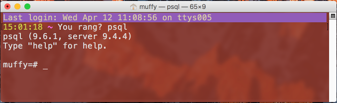

# Install Postgres
## Why?
Postgres is the database we will be using for the course.
Running it locally allows you to try it out without affecting anyone else.
It also allows you to run it even if you are not connected to a network.

## How?

### Mac OS X
Install [Postgres.app for Mac from the official site](https://postgresapp.com/), according to their instructions.
You only need to do instructions 1 and 2.

You should now have Postgres running locally. If it is ever not running, go to your Applications folder
(open Finder and press Command-Shift-A) and find the elephant.

Double-click it to open. Look for the elephant in your top bar to change the settings.

Click on the little elephant and select Preferences. Make sure that it is set to open when you start your machine.

Close the Preferences window.

Now open a terminal and try to run Postgres with the command

    % psql

You should now be in a Postgres command line.
You can tell because the prompt ends in "=#".
The text before the "=" is the database you are currently looking at; this
defaults to a database with your username.

    muffy=#

If this does not work, use

    % ln -s /Applications/Postgres.app/Contents/Versions/9.6/bin/psql /usr/local/bin/

then try running

    % psql
    muffy=#
    
again.

### Windows

Install [Postgres for Windows from the official site (install version 9.6)](https://www.postgresql.org/download/windows)

You can agree to all the defaults as it is installing. Pick a password you can remember,
this will only run on your local machine.

You do not need to run StackBuilder, you can exist the installation at this point.

Once it has installed, you can launch the command line using the
PostgreSQL -> SQL Shell option in your Start menu.

