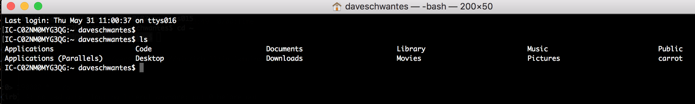

# Make Friends With Terminal

## Why

Because it makes you look cool to type things into a black window with white text. Honestly the value in using Terminal (or a "command line interface") is that it helps you do things faster and automate repetitive tasks. From the terminal you have many powerful tools at your disposal and a lot of your development tasks will happen here.

## How

Go to **Applications → Utilities** or use Spotlight Search (**cmd+space**) and type "terminal" to find the Terminal app. I'd recommend pinning this to your dock because you'll be using it a lot.

## Quick reference

You'll see a blank screen with a cursor. You are in your "home" directory. Type `ls` to see what files and folders are in there. This is like looking in Finder for files and folders.

[Here](shell.md) is quick reference for the most useful commands you might use from the terminal.
