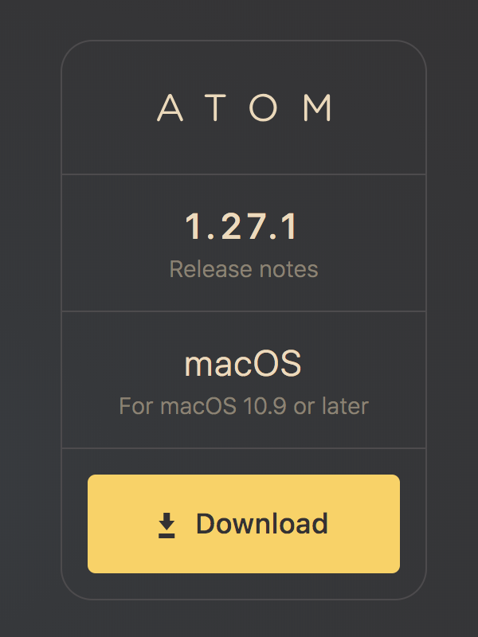
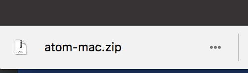
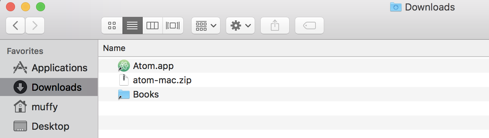
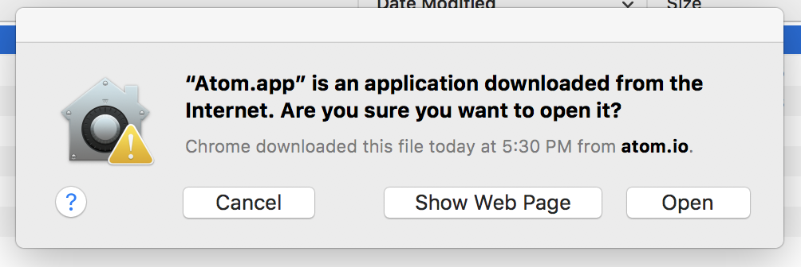

# Pick a text editor

There are so many text editors out there, many of which are Interactive Development
Environments (IDEs) that you will probably get a different answer from every developer
you ask as to what their favorite editor is and why.

Unless you already have a code-aware editor you are comfortable with, we suggest using
[Atom from Github](https://atom.io/). It allows for a great deal of customization for
different languages, great GitHub integration (of course!), and collaboration with others.

## Installation instructions

1. Download the latest version from [atom.io](https://atom.io)

2. Open the .zip file by clicking on the download status link at the bottom of your browser

3. Move `Atom.app` from where you extracted it from the .zip file (usually your `Downloads` folder)
 to your `Applications` folder
 
4. Open Atom from your Applications folder
5. if you get a warning about applications downloaded from the Internet, just click Open
