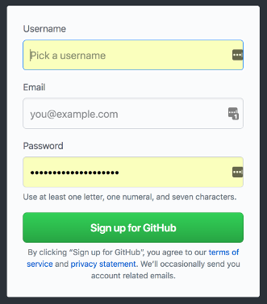

# Create a Github Account
## Why?
We'll be using Github (https://github.com/) to share course work. It is the most popular public code-sharing
and collaboration site, and many employers want to look at your Github account to see your work.

## How?
1. Visit [github.com](https://github.com/) and follow the instructions there for creating an account. 

2. Once you have created your account, request membership in the [carrot-u organization](https://github.com/carrot-u).
This will give you access to our documentation, class assignments, and class project.
Ping James Jalandoni with your github username in #carrot-university to get access.