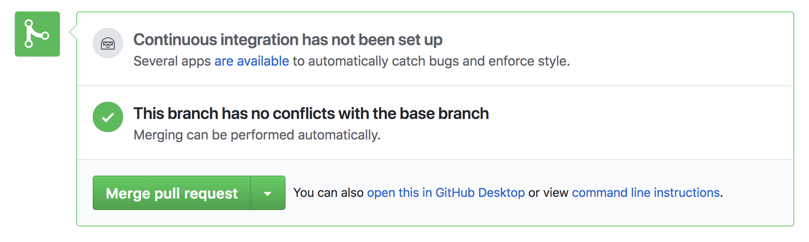

## Submitting via Git
### Initial setup
If you do not yet have a git directory, create it

    % cd
    % mkdir git    # create a directory

Now, clone the repository

    % cd ~/git
    % git clone https://github.com/carrot-u/assignments
    
This creates an exact copy of all of the files in the repository on your local computer.
You can now operate on them locally without affecting the repository or even needing a network connection.
    
You should only have to do these two steps once, but you can delete the repository (`rm -rf ~/git/assignments`) and repeat the clone if your directory becomes corrupted.  

### For each homework

Create a branch.

    % git checkout -b <branch_name>

I usually name the branch for myself, plus the thing I am working on, e.g.

    % git checkout -b muffy/guessing-game
    
Create a new directory for your code in the directory for the assignment you are working on.

    % cd ~/git/assignments/week1
    % mkdir muffy

### Submit your work

Create and test your code, then add it to git:

    % cd ~/git/assignments/week1/muffy
    % git commit -a -m "Muffy's version of the guessing game"
    
This adds all (`-a`) local changes to your local copy of the repository, with a 
message (`-m "Muffy's version of the guessing game"`) explaining what they are.
Git is now watching your new file(s), but there is another step before other people can see them.
    
    % git push -u origin muffy/guessing-game
    
This connects your branch to a remote copy of it (`-u origin muffy/guessing-game`)
and pushes your changes across the network to the repository on Github. Now anyone can see them. If you want to make
more changes and push them again, that connection already exists, so you can just use:

    % git push
    
### Use your editor instead

You should know how to use the command line to do these operations, but generally your code editor will have
an integration with git and Github, so for convenience and speed, you should set that up and learn to use it.
If you are using [Atom](https://github.com/atom), it has very good Github integration since it was built by Github!

### Create a "pull request"

Now that you have committed and pushed your code,
go to [the repository on Github](https://github.com/carrot-u/assignments/branches) and find your branch.

Start a new pull request using the button. Comment the contents appropriately. We use "WIP" (Work In Progress) to comment something which is not yet finished. *Feel free to add your code and create a pull request before it is finished.* Part of 
the development process is getting comments from others on your code.

Finally, click "Create pull request".

### Revise it!

One or two of the mentors will make comments on your pull request. While is is not required, it is good practice to address
those comments either by responding to them on Github or making changes to your code based on the comments
and re-submitting it. You learn as much or more from making these changes as from doing the exercises.

### Merge your branch

Once you are satisfied with your work, you want to make it part of the master branch. This is very easy to do on Github:

1. Go to [the page of branches](https://github.com/carrot-u/assignments/branches)
1. Find your branch and click on the green "Open"  button to the right of it
1. Scroll to the bottom and click the green "Merge pull request"  button
